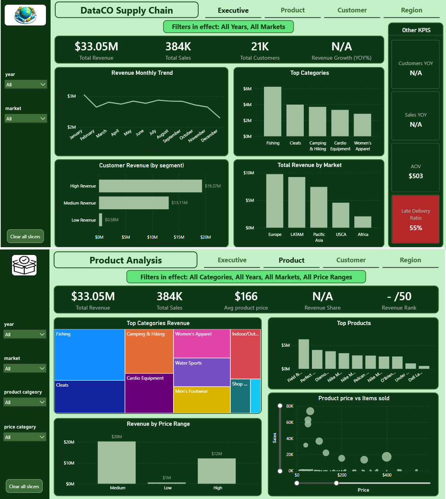

# DataCo Supply Chain Analysis

## Overview

This project analyzes DataCo's supply chain operations using Python, PostgreSQL, SQL, Power BI, and DAX. The objective is to transform raw transactional data into an interactive Business Intelligence solution that supports executive, product, customer, and regional decision-making.

The project follows a complete analytics workflow, including data exploration, cleaning, feature engineering, dimensional modeling, dashboard development, and business insight generation.

---

## Dashboard Preview

### Executive Overview



---

## Tech Stack

**Programming & Analysis**

* Python

  * pandas
  * NumPy
  * Matplotlib

**Database**

* PostgreSQL
* SQL

**Business Intelligence**

* Power BI
* DAX

**Version Control**

* Git
* GitHub

---

## Dataset

**Source**

[Mendeley Data](https://data.mendeley.com/public-api/zip/8gx2fvg2k6/download/2)

The raw dataset is not included in this repository due to file size limitations.

Dataset summary:

* ~180,000 rows
* 53 columns
* Grain: **Order Item**

---

# Project Workflow

## Stage 1 — Data Exploration

The dataset contains three tables:

* A transactional dataset containing 53 columns
* A data dictionary describing each field
* A supplementary product information table

For this project, only the transactional dataset (**DataCoSupplyChainDataset**) was used.

Initial exploration focused on:

* Understanding the logical entities contained within the denormalized dataset
* Identifying the correct analytical grain and primary key
* Inspecting data completeness
* Verifying timestamp consistency across operational events

Key entities identified:

* Orders
* Order Items
* Customers
* Products
* Locations
* Payments
* Discounts
* Delivery Information

This stage established the logical foundation used for the star schema design.

---

## Stage 2 — Data Cleaning & Validation

Initial cleaning and validation were performed in Python to ensure data quality before modeling.

Key tasks included:

* Identifying missing values
* Handling null values
* Standardizing country names to English
* Correcting inconsistent data types
* Validating key uniqueness
* Verifying relationships between orders and order items
* Confirming timestamp consistency
* Ensuring join compatibility across entities

These validation steps ensured the dataset could support reliable analytical modeling.

---

## Stage 3 — SQL Data Modeling

A star schema was designed and implemented in PostgreSQL to optimize analytical performance.

### Fact Table

**fact_sales**

* order_item_id (Primary Key)
* order_id
* customer_id
* product_id
* location_id
* date_key
* quantity
* revenue
* net_revenue
* discount
* profit_ratio
* discount_ratio
* late_delivery_risk
* days_for_shipping_real
* days_for_shipping_scheduled

### Dimension Tables

* dim_customers
* dim_products
* dim_location
* dim_date

### Supporting Tables

**customer_purchase_summary**

A supporting table created to analyze purchase frequency distribution by grouping customers according to the number of purchases they made.

---

## Stage 4 — Feature Engineering

Additional analytical features were engineered to support deeper business analysis.

Features include:

* Order Value Segmentation
* Customer Revenue Segmentation
* Product Price Segmentation (Quantile-based)
* Late Delivery Rate
* Product Price Groups

These engineered features directly informed dashboard design and business interpretation.

---

## Stage 5 — Power BI Semantic Model

The dimensional model was imported into Power BI.

Key modeling decisions included:

* Dedicated Date dimension
* Controlled cross-filter directions
* Proper relationship management
* Star schema implementation for improved performance

---

## Stage 6 — DAX Metrics & Business Logic

Business metrics were implemented using DAX and organized by dashboard page.

Examples include:

* Total Revenue
* Total Sales
* Total Customers
* Revenue Growth
* Repurchase Rate
* Customer Growth (YoY)
* Category Revenue Share
* Late Delivery Rate
* Revenue Contribution by Customer Segment

### Product Price Segmentation

Exploratory Data Analysis identified a heavily skewed product price distribution.

Products were segmented using quartiles:

* Low: Price ≤ Q1
* Medium: Q1 < Price ≤ Q3
* High: Price > Q3

This segmentation allows more meaningful comparison across product categories where average prices differ significantly.

---

## Stage 7 — Dashboard Design

The final dashboard consists of four analytical pages.

### Executive Overview

* Overall business performance
* Revenue trends
* Category performance
* Market performance
* Operational KPIs

### Product Analysis

* Product performance
* Category contribution
* Price segmentation
* Revenue distribution
* Product rankings

### Customer Analysis

* Customer segmentation
* Purchase frequency
* Repurchase behavior
* Revenue concentration
* Top customers

### Regional Analysis

* Geographic revenue distribution
* Country performance
* Market comparison
* Delivery performance
* Interactive map visualization

Interactive filtering is supported by:

* Year
* Product Category
* Market
* Customer Segment
* Price Segment

---

# Key Business Insights

### Revenue Concentration

Approximately **25% of customers generate nearly 60% of total revenue**, indicating a highly concentrated customer base. Retaining high-value customers would likely have a disproportionate impact on overall business performance.

---

### Customer Purchase Behavior

Approximately **40% of customers make only a single purchase**, highlighting opportunities to improve customer retention and repeat purchasing strategies.

---

### Product Pricing

Revenue is primarily generated from products within the **Medium price segment**, while High-price products contribute less frequently due to lower purchase volume.

---

### Delivery Performance

Approximately **55% of orders were delivered late**, suggesting operational inefficiencies within the logistics process that warrant further investigation.

---

# Repository Structure

```text
project-root
│
├── 01_clean_data
│   ├── 01_data_check
│   └── cleaned_dataset.csv
│
├── 02_sql_modeling
│   └── SQL scripts
│
├── 03_powerbi
│   └── powerbi_dashboard.pbix
│
├── 04_media
│   └── Dashboard screenshots
│
└── README.md
```

---

# Lessons Learned

Throughout this project I:

* Designed and implemented a complete star schema from transactional data.
* Applied Exploratory Data Analysis to guide segmentation decisions rather than treating EDA as a standalone exercise.
* Built an interactive Power BI dashboard focused on supporting business decisions rather than simply displaying visualizations.
* Strengthened practical skills in SQL, DAX, dimensional modeling, and Business Intelligence best practices.

---

# Future Improvements

Potential extensions include:

* Customer Cohort Analysis
* Customer Lifetime Value (CLV)
* Discount Impact on Sales and Profit
* Inventory Optimization
* Demand Forecasting using Time Series models
* Financial Performance Analysis
